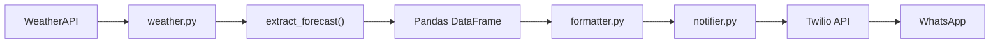
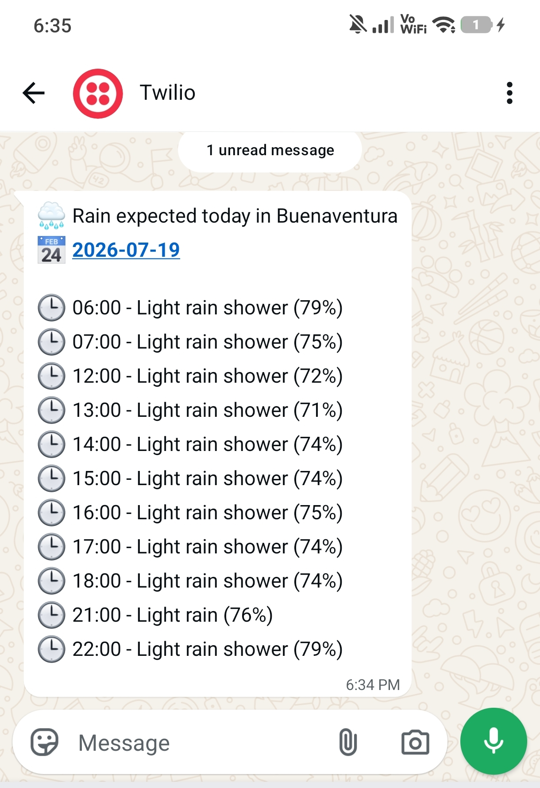
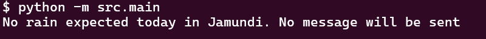

# Weather Alert Bot 🌧️

## Receive automated WhatsApp notifications when rain is expected.

A Python application that retrieves hourly weather forecasts from WeatherAPI and automatically sends WhatsApp notifications when rain is expected during the day.

## Workflow



## Features

- Retrieves hourly forecasts from WeatherAPI
- Filters rain events between configurable hours
- Sends WhatsApp notifications using Twilio
- Uses environment variables for API credentials
- Modular project structure
- Basic HTTP error handling

## Technologies

- Python
- Requests
- Pandas
- Twilio API
- WeatherAPI

## Project Structure

```text
project_01_weather/
│
├── README.md
├── requirements.txt
├── .env.example
├── .gitignore
│
├── notebook/
│   └── Messages_Twilio.ipynb
│
├── src/
│   ├── main.py
│   ├── weather.py
│   ├── formatter.py
│   └── notifier.py
```

## Installation

Clone the repository

```bash
git clone git@github.com:IngDavidHoyosGil/weather-alert-bot.git
```

Create a virtual environment

```bash
python -m venv .venv
```

Activate it

```bash
source .venv/bin/activate
```

Install dependencies

```bash
pip install -r requirements.txt
```

## Environment Variables

Create a `.env` file using `.env.example`.

Required variables:

```text
API_KEY_WAPI=
TWILIO_ACCOUNT_SID=
TWILIO_AUTH_TOKEN=
PRIVATE_NUMBER=
```

## Run

Edit the city in `src/main.py`:

```python
query = "London"
```

Then execute:

```bash
python -m src.main
```

## Example Output

### Rain expected

<p align="center">
  
</p>

### No rain expected

<p align="center">
    
</p>

## Notes

This project uses the Twilio WhatsApp Sandbox.

Before running the application:

1. Open the Twilio Console.
2. Navigate to **Messaging → Try it out → Send a WhatsApp message**.
3. Follow the instructions to join the sandbox by sending the provided code from your WhatsApp account.
4. Once joined, run the application normally.

If the sandbox session expires, repeat the join process.

## Future Improvements

- Docker support
- Unit tests
- GitHub Actions CI
- Deploy on AWS EC2
- Schedule execution with cron
- Support multiple cities
- Replace the Twilio Sandbox with a production WhatsApp Business sender

## Roadmap

- [x] Consume WeatherAPI
- [x] Process hourly forecast
- [x] Send WhatsApp notifications
- [ ] Deploy on AWS EC2
- [ ] Automate with cron
- [ ] Containerize with Docker